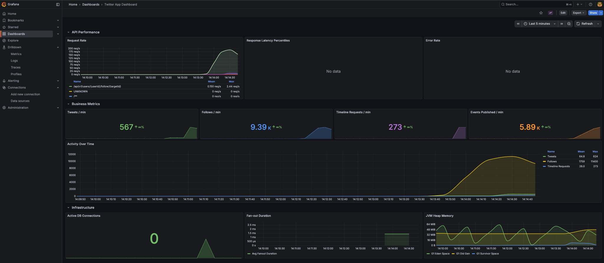

# Runbook

> **Note**: All `localhost` references in this document can be replaced with the server IP if using a deployed instance (e.g., `http://XXX.XXX.XXX.XXX:8080` instead of `http://localhost:8080`).

## Access Points

| Service | URL |
|---------|-----|
| API | http://localhost:8080 |
| API Docs ▶️ **interactive** | http://localhost:8080/docs.html |
| Grafana (logs/metrics) | http://localhost:3000 (login: `admin` / `admin`) |
| Prometheus | http://localhost:9090 |

## Quick Start

### Prerequisites
- Docker & Docker Compose

> **Docker Version Note**: Docker Desktop 4.57+ has API compatibility issues with Testcontainers.
> - **Recommended**: [Docker Desktop 4.35.1](https://docs.docker.com/desktop/release-notes/#4351) or earlier
> - **If using 4.57+**: Ensure `docker.api.version=1.44` is set (already configured in `src/test/resources/testcontainers.properties`)

### 🔷 Option A — Easiest => Use the deployed version

> 🚀 **Already deployed!** Skip setup entirely and test against a live instance:
> 
> **http://149.56.133.44:8080**
> 
> *VPS in Canada (4 vCPU, 8 GB RAM) — not performance-tuned, expect higher latency from other regions.*

### 🔷 Option B — Most control => Run with Docker

```bash
# Start all services (app + PostgreSQL + Redis + Redpanda + observability)
docker compose --profile prod up --build -d

# View logs
docker compose --profile prod logs -f twitter-app-prod

# Stop
docker compose --profile prod down -v
```

## Development

### Run Locally

```bash
# Start infrastructure only
docker compose --profile dev up -d

# Run app with Gradle
./gradlew bootRun

# Or run from IDE: Run the main class
# com.twitter.TwitterApplication
```

### Run Tests

```bash
# All tests (requires Docker for Testcontainers)
./gradlew test

# Or run from IDE: Right-click test class/method → Run

# View coverage report
open build/reports/jacoco/test/html/index.html
```

> **Note**: Tests use Testcontainers to spin up PostgreSQL, Redis, and Redpanda in Docker.

## Load Testing

A Python-based load tester is included for stress testing and verification.

```bash
# ⚠️ IMPORTANT: First, navigate to the load-test directory
cd load-test
```

```bash
# Build the load tester image (from load-test/)
~/twitter/load-test$ docker build -t twitter-load-test .

# Full load test (RECOMMENDED) - significant stress test with configurable users
~/twitter/load-test$ docker run --rm -it twitter-load-test <host:port>

# Minimal smoke test to verify all endpoints work (2 users, shows actual responses, use for diagnostics)
~/twitter/load-test$ docker run --rm -it twitter-load-test --smoke <host:port>
```

**What to use for `<host:port>`:**

🔷 **Deployed server** (the live VPS instance):
```bash
docker run --rm -it twitter-load-test http://149.56.133.44:8080
```

🔷 **Local Docker** (Mac/Windows):
```bash
docker run --rm -it twitter-load-test http://host.docker.internal:8080
```

🔷 **Local Docker** (Linux):
```bash
docker run --rm -it twitter-load-test http://192.168.1.100:8080  # use your machine IP
```

See [load-test/README.md](load-test/README.md) for more detail, for instance if you want to change config.

## Observability

### Grafana Dashboard

Access at http://localhost:3000 (login: `admin` / `admin`)



### Logs (Loki)

Go to **Explore** → **Loki** → Query by `requestId` or `userId`

### Log Correlation

Every request gets a `requestId` for tracing:

```json
{
  "message": "Tweet created successfully",
  "userId": "550e8400-...",
  "requestId": "c8b6298e-..."
}
```

Query in Loki: `{job="twitter"} |= "c8b6298e"`

## Configuration

Key settings in `application.yml`:

```yaml
app:
  timeline:
    celebrity-follower-threshold: 5000  # Fan-out-on-read threshold
    cache-size: 800                     # Tweets per timeline in Redis

spring:
  datasource:
    hikari:
      maximum-pool-size: 30             # DB connection pool
```

## Admin Endpoints (Advanced)

### Stats Endpoint

Check current data counts without modifying anything:

```bash
curl http://localhost:8080/api/v1/demo/stats  # set your target host:port
```

Example response:
```json
{
  "users": 10052,
  "tweets": 572,
  "follows": 10300,
  "pendingOutboxEvents": 0
}
```

### Reset Endpoint

> ⚠️ **Demo/Testing Only** — This endpoint exists purely for development and load testing convenience. A real production system would **never** expose an unauthenticated endpoint that wipes all data.

Useful for cleaning up all data (PostgreSQL, Redis, Kafka) between test runs:

```bash
curl -X POST http://localhost:8080/api/v1/demo/reset  # set your target host:port
```

Example response:
```json
{
  "status": "reset_complete",
  "timestamp": "2026-01-28T07:19:15.177259758Z",
  "cleared": {
    "users": 10052,
    "tweets": 572,
    "follows": 10300,
    "outboxEvents": 7772,
    "timelineKeys": 3348,
    "kafkaRecordsPurged": 3406
  }
}
```

> **Note**: This endpoint does not require authentication (`X-User-Id` header).

## Memory Configuration (Advanced)

Default configuration is tuned for an 8GB VPS:

| Service | Memory | Where to modify |
|---------|--------|-----------------|
| App (JVM) | 2GB container, ~1.5GB heap | `docker-compose.yml` → `twitter-app-prod` → `deploy.resources.limits.memory` |
| JVM heap % | 75% of container | `Dockerfile` → `ENTRYPOINT` → `-XX:MaxRAMPercentage=75.0` |
| Redpanda | 512MB | `docker-compose.yml` → `redpanda` → `--memory 512M` |
| PostgreSQL | OS managed | Add `deploy.resources.limits.memory` if needed |
| Redis | OS managed | Add `deploy.resources.limits.memory` if needed |

**Estimated total**: ~5-6GB, leaving headroom for OS on an 8GB machine.
